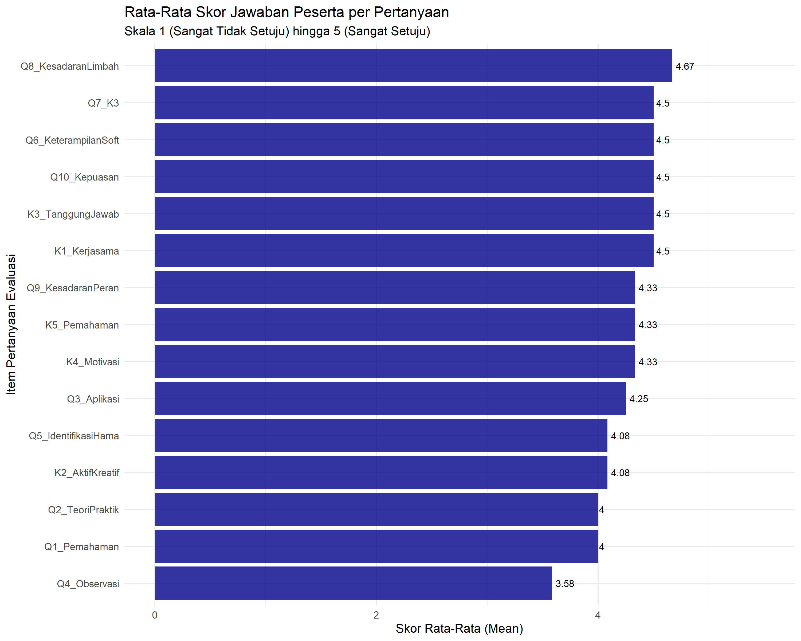
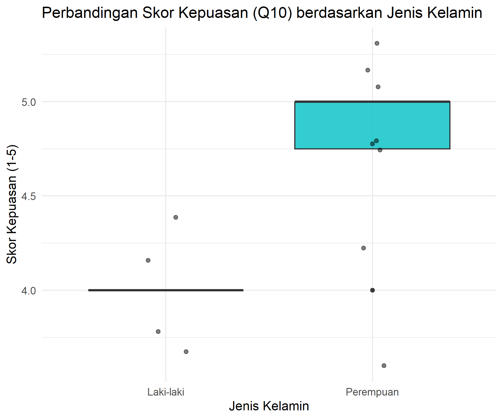
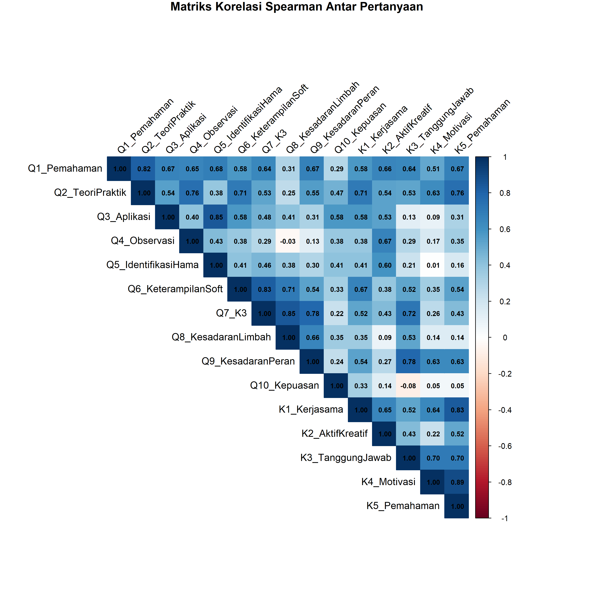

# Analisis Evaluasi Kegiatan PKM BIMA - Eco-Enzyme & Lebah Kelulut

Repositori ini berisi data mentah, skrip analisis R, dan hasil evaluasi untuk kegiatan pembelajaran kontekstual (Field-based Learning) mahasiswa Biologi FMIPA ULM di Desa Padang Panjang.

---

## Ringkasan Analisis dan Temuan Utama

### 1. Pendahuluan

Analisis ini bertujuan untuk mengevaluasi pencapaian tiga tujuan utama kegiatan: (1) pemahaman dan keterampilan aplikasi *eco-enzyme*, (2) efektivitas peningkatan kompetensi dan kesadaran lingkungan, dan (3) kepuasan peserta terhadap *Field-based Learning* (FBL). Metodologi yang digunakan adalah analisis *mixed-methods*, menggabungkan statistik deskriptif kuantitatif dari kuesioner skala Likert (1-5) dan analisis tematik kualitatif (frekuensi kata dan bigram) dari respons esai.

### 2. Temuan Kuantitatif Utama

Analisis deskriptif terhadap 15 item kuesioner (N=12) menunjukkan persepsi peserta yang sangat positif.

* **Kepuasan Keseluruhan:** Item `Q10_Kepuasan` mencatat skor rata-rata (Mean) $4.5$ dari $5.0$.
* **Persepsi Tertinggi:** Item `Q8_KesadaranLimbah` (Mean: $4.67$).
* **Keterampilan Tertinggi:** Item soft-skill `K1_Kerjasama` (Mean: $4.5$) dan item kesadaran `Q7_K3` (Kebersihan) (Mean: $4.5$).
* **Persepsi Terendah:** Item `Q5_IdentifikasiHama` (Mean: $4.17$), meskipun masih dalam kategori positif.

Visualisasi skor rata-rata untuk semua item disajikan di bawah ini:

Analisis komparatif menggunakan Uji Wilcoxon-Mann-Whitney tidak menunjukkan perbedaan yang signifikan secara statistik dalam skor kepuasan (Q10) antara peserta laki-laki dan perempuan ($p > 0.05$).

### 3. Temuan Kualitatif Utama

Analisis frekuensi teks dari respons terbuka mengidentifikasi tiga tema dominan:

1.  **Konsep Lingkungan (Tema Sentral):** Kata `lingkungan` (n=63) adalah unigram yang paling sering muncul, dikontekstualisasikan oleh bigram `menjaga kebersihan` (n=13) dan `kebersihan lingkungan` (n=10).
2.  **Konsep Teknis (Eco-Enzyme):** Tema ini didominasi oleh frasa `limbah organik` (n=22), yang secara langsung mendukung tingginya skor pada item `Q8_KesadaranLimbah`.
3.  **Metode Pembelajaran (FBL):** Tema *soft-skill* sangat menonjol, diwakili oleh frasa `kerja sama` (n=13). Aspek pengalaman langsung dari FBL juga terekam dalam frasa `secara langsung` (n=6).

### 4. Analisis Korelasi dan Sintesis

Analisis korelasi Spearman berfungsi untuk mensintesis temuan kuantitatif dan kualitatif.

* Kepuasan keseluruhan (`Q10_Kepuasan`) menunjukkan korelasi positif yang sangat kuat dengan `K1_Kerjasama` ($r_s$ = $0.79$) dan `Q8_KesadaranLimbah` ($r_s$ = $0.74$).
* Korelasi kuat juga teridentifikasi antara `Q8_KesadaranLimbah` dan `Q9_KesadaranPeran` ($r_s$ = $0.80$), menunjukkan bahwa pemahaman akan solusi limbah berkontribusi signifikan terhadap peningkatan kesadaran untuk berperan aktif.

### 5. Kesimpulan

Data kuantitatif dan kualitatif secara konvergen menunjukkan bahwa ketiga tujuan evaluasi telah tercapai.

1.  **Pemahaman & Keterampilan:** Tercapai, dibuktikan dengan kemunculan frasa teknis spesifik seperti `limbah organik` dan `pestisida alami`.
2.  **Kesadaran Lingkungan:** Tercapai secara signifikan. Ini adalah temuan terkuat, didukung oleh skor tertinggi pada `Q8_KesadaranLimbah` (Mean $4.67$) dan dominasi tema `lingkungan` (n=63).
3.  **Kepuasan FBL:** Tercapai dengan skor kepuasan tinggi (Mean $4.5$). Analisis korelasi mengidentifikasi bahwa kepuasan ini sangat didorong oleh dua pilar: keberhasilan dalam menumbuhkan kesadaran akan "limbah organik" dan fasilitasi "kerja sama" tim.
